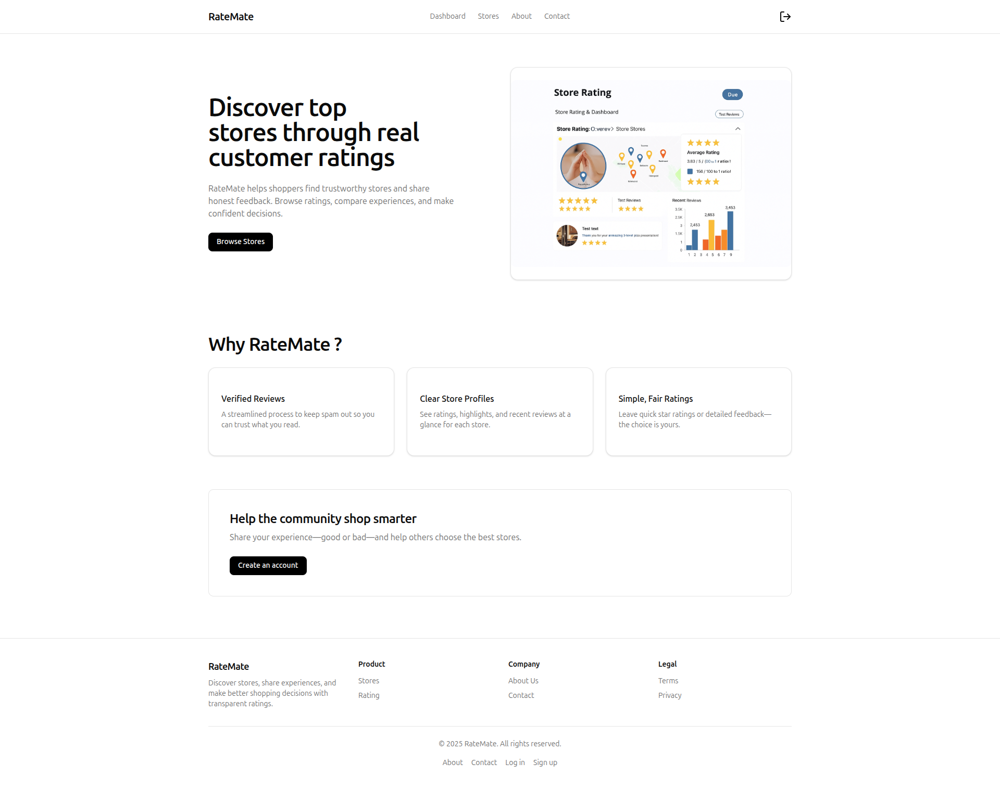
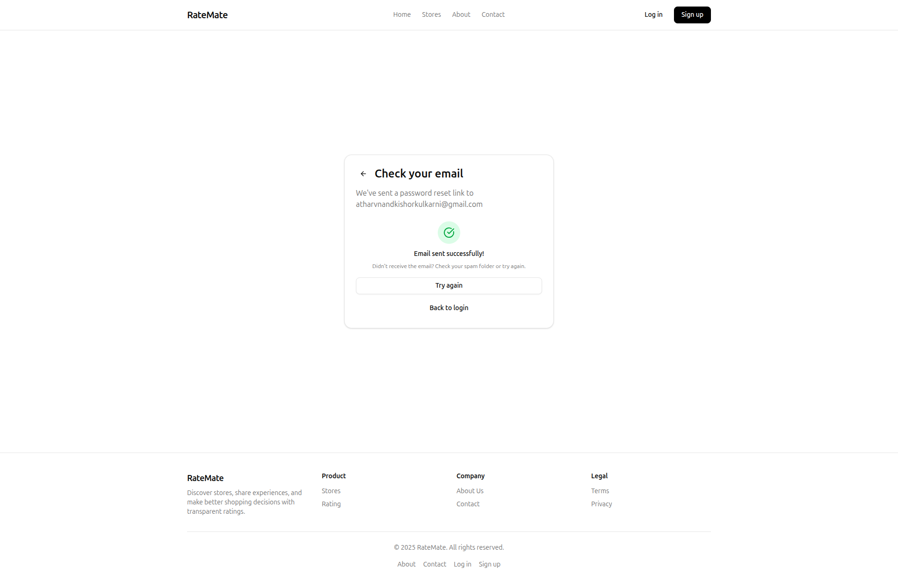
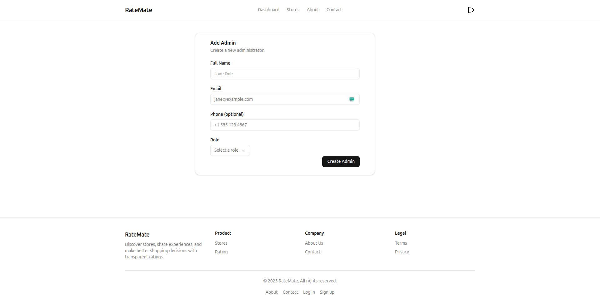
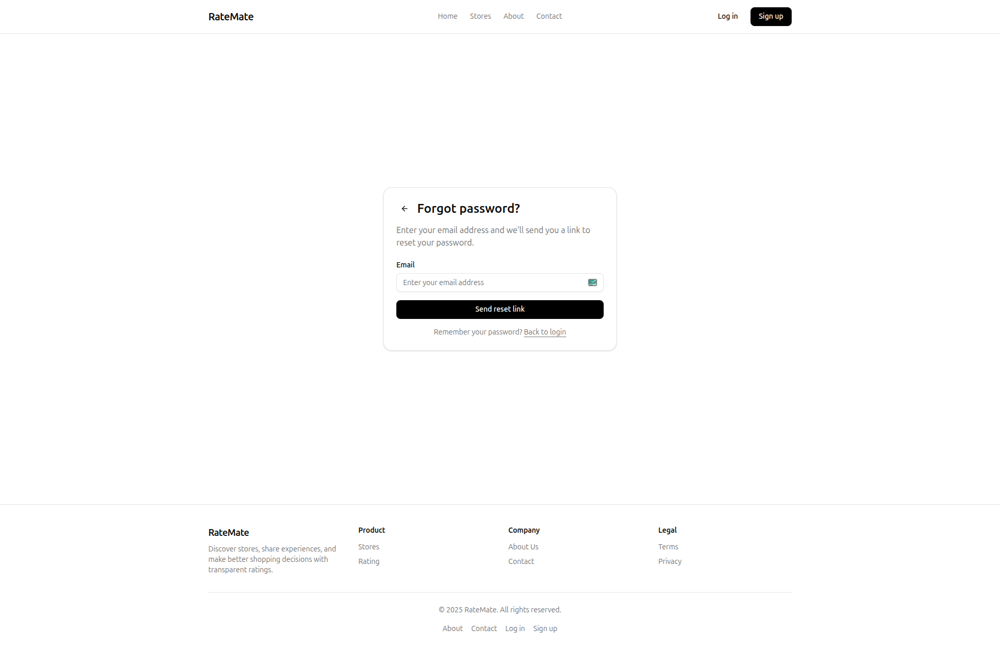
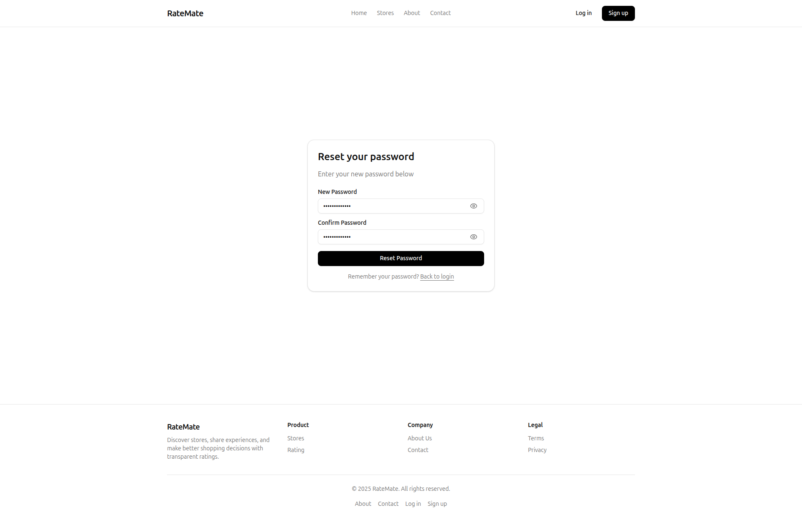
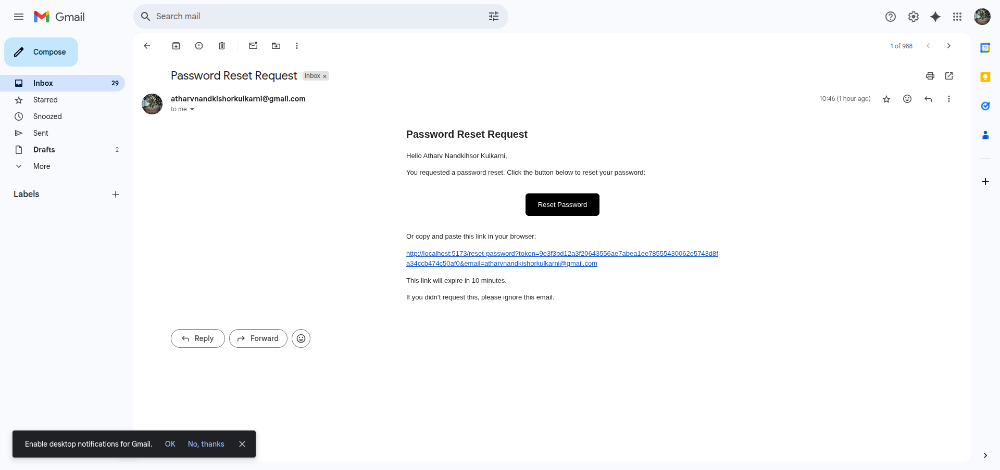
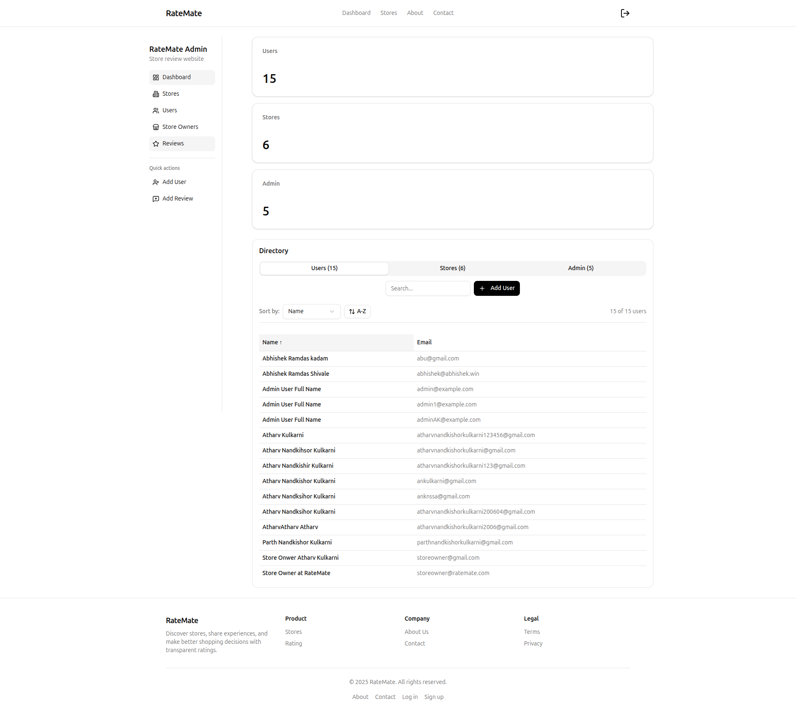
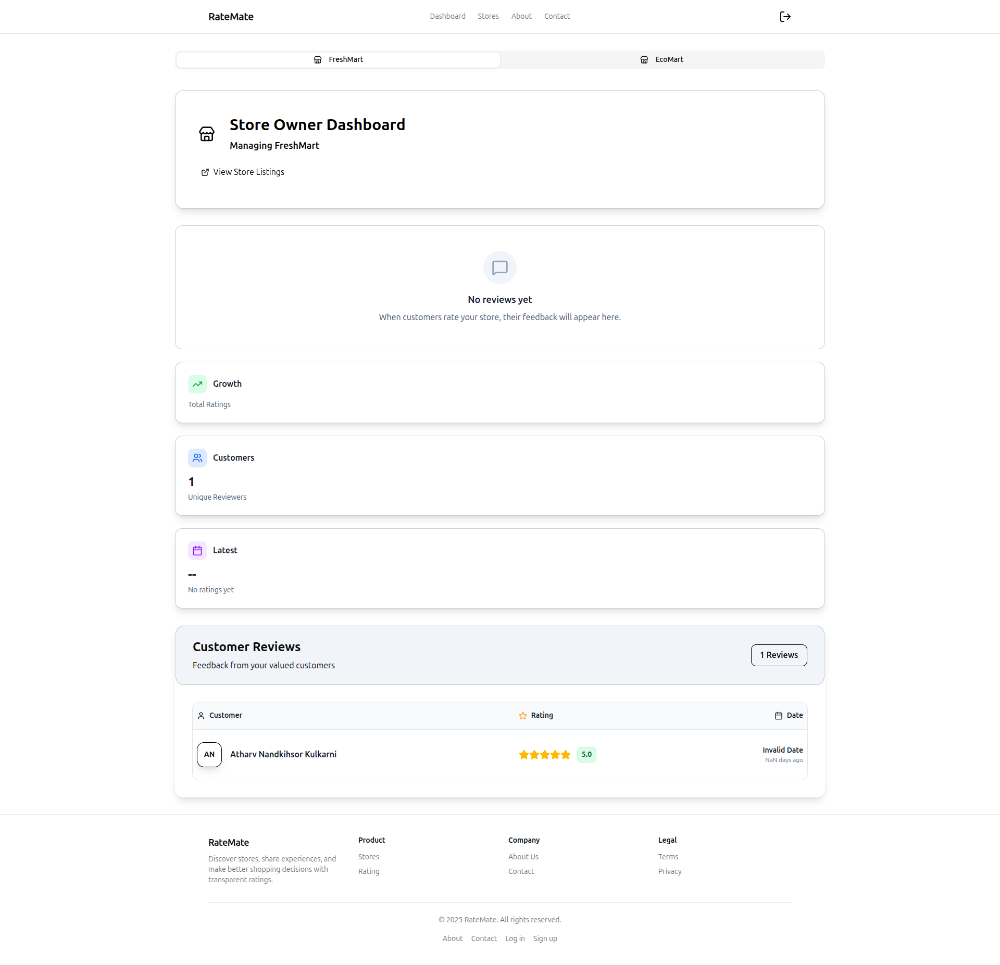
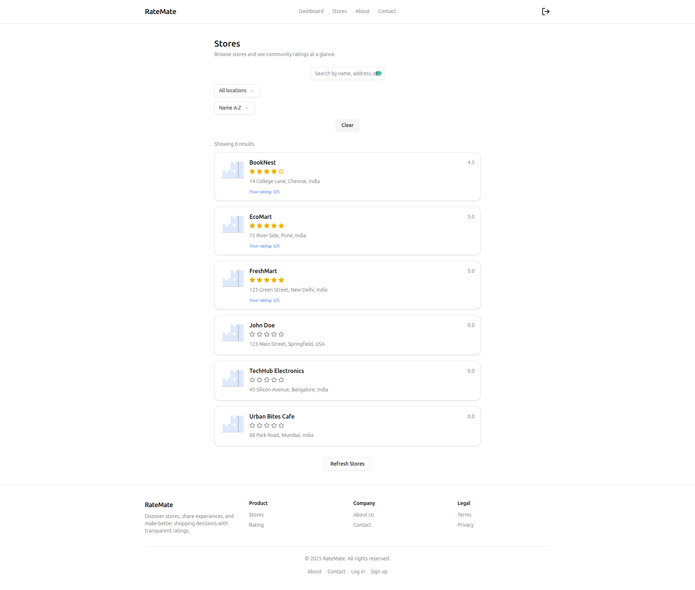
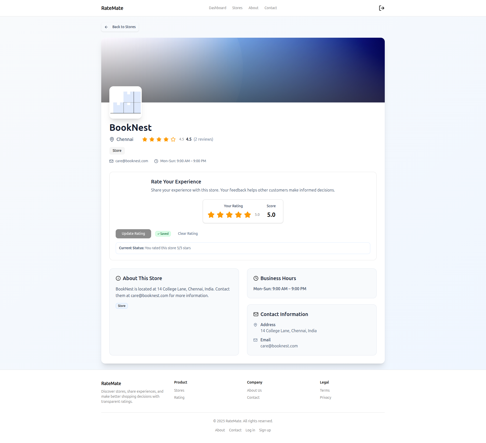

# 📊 RateMe

A full-stack web application where users can **rate stores** on a scale of 1–5.  
It supports multiple user roles (**Admin, Normal User, Store Owner**) with different dashboards and permissions.

---

## ✨ Features

### 👨‍💻 System Administrator
- Add new stores, users (normal/admin), and store owners  
- Dashboard with:  
  - Total number of users  
  - Total number of stores  
  - Total number of submitted ratings  
- View, filter, and manage users and stores  
- View store details including ratings  
- Secure login & logout  

### 🙍 Normal User
- Sign up and log in  
- Update password  
- Browse and search stores by **Name** or **Address**  
- View store listings with:  
  - Store Name  
  - Address  
  - Overall Rating  
  - User’s Submitted Rating  
- Submit or update ratings (1–5)  
- Secure login & logout  

### 🏪 Store Owner
- Log in & update password  
- Dashboard with:  
  - List of users who rated their store  
  - Average store rating  
- Secure login & logout  

---

## 🛠 Tech Stack

| Frontend | Backend | Database | Runtime | Deployment |
|----------|---------|----------|---------|------------|
|  |  |  |  | <br> |

---

## 📋 Form Validations
- **Name:** 20–60 characters  
- **Address:** Up to 400 characters  
- **Password:** 8–16 characters, at least one uppercase + one special character  
- **Email:** Standard email format  

---

## ⚙️ Installation & Setup

### Prerequisites
- Node.js & npm  
- MySQL Database  

### Steps
```bash
# Clone the repo
git clone https://github.com/your-username/RateMe.git
cd RateMe

# Install dependencies
cd api
npm install
cd ../client
npm install

# Setup environment variables
# Example for backend (.env)
PORT=5000
DB_HOST=localhost
DB_USER=root
DB_PASSWORD=yourpassword
DB_NAME=rateme

# Run backend
cd api
npm run dev

# Run frontend
cd client
npm run dev
```
## 📸 Output / Screenshots  


### 🏠 Home Page  

| Home |
|------|
|  |

---

### 🔐 Authentication Screens  

| Login | Signup |
|-------|--------
|  |  | 
| Password Reset Mail | Forgot Password |
|-----------------|----------------|
|  |  |
| Reset Password | 
|----------------------|
  |

---

### 👨‍💻 Admin Dashboard  

| Admin Dashboard |
|-----------------|
|  |

---

### 🏪 Store Owner Dashboard  

| Store Owner Dashboard |
|------------------------|
|  |

---

### 📋 Store Pages  

| Store List | Store Details |
|------------|---------------|
|  |  |


